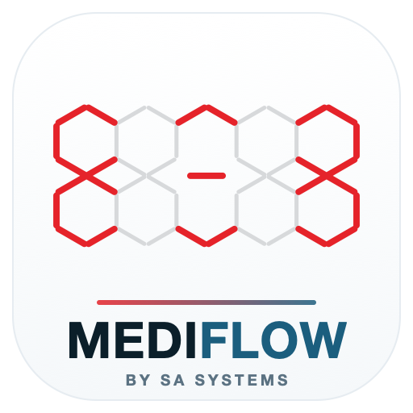

<div align="center">



# MEDIFLOW by SA Systems

### Clinic &amp; Diagnostics ERP for Odoo

One platform — front desk to lab bench to revenue cycle. Multi-currency and
global-ready, on a secure, audited, FHIR-ready foundation.


</div>

---

## Overview

**MEDIFLOW** is a complete, country-agnostic Clinic + Diagnostics ERP for Odoo.
A single install gives a multi-specialty clinic, hospital outpatient department
or reference laboratory everything it needs — clinical care, diagnostics and the
full revenue cycle — without bolting together a dozen disconnected apps.

- **Multi-currency &amp; multi-company are standard.**
- A one-click **Region Profile** localizes language, currency, timezone and the
  governing privacy framework (HIPAA, GDPR, UK GDPR, PDPA, LGPD, PIPEDA, PDPL, DPDP).
- Runs from a **single, series-agnostic codebase on Odoo 18.0 and 19.0**
  (Community or Enterprise).

## Highlights

| Area | What you get |
|------|--------------|
| 🩺 **EMR-lite** | Patients, practitioners, encounters, problems, allergies, vitals, immunizations, consent and clinical documents. |
| 📅 **Scheduling** | Resource-based, conflict-free booking with a database-level double-booking guard and a live calendar. |
| 🧪 **Laboratory** | LOINC catalog, panels, orders, specimen accessioning, verified &amp; released results with hard immutability and critical-value alerting. |
| 💊 **Pharmacy** | Prescriptions with allergy/interaction checks and FEFO, expiry-aware dispensing on real Odoo Inventory stock moves. |
| 💳 **Billing** | Charge capture from clinical events into Odoo Accounting invoices — fully multi-currency. |
| 🛡️ **Insurance &amp; Claims** | Payers, coverage, pre-authorization and the full claim lifecycle with patient-responsibility recomputation. |
| 🌐 **Patient Portal** | Self-service appointments, consent-gated lab results and online invoice payment. |
| 🎫 **Queue** | Per-service-point tokens with a live waiting board. |
| 🤖 **AI Assist** | Explainable no-show prediction, triage acuity suggestion and human-reviewed summaries (offline-first, deterministic fallbacks). |
| 🔌 **FHIR R4 API** | Read-oriented, consent-gated Patient, Encounter, Observation, DiagnosticReport, MedicationRequest and Coverage resources. |
| 📊 **Analytics** | Operational, clinical and revenue dashboards computed in PostgreSQL views, isolated per company. |
| ⚡ **Integrations** | HMAC-signed webhooks, durable domain events, Stripe payment links, Twilio SMS/WhatsApp reminders, telehealth rooms and an authenticated HL7 inbound endpoint. |

## One application

MEDIFLOW ships as a **single `mediflow` application**. One install delivers the
complete suite below — no add-on hunting, no inter-module version juggling. The
capabilities are organized internally as cohesive domains:

| Domain | Coverage |
|--------|----------|
| Core &amp; security | Patient/practitioner master data, security groups, PHI audit. |
| Domain events | Durable event backbone powering automation &amp; integrations. |
| EMR | Encounters, problems, allergies, vitals, immunizations, consent. |
| Scheduling | Resource-based booking with a double-booking guard. |
| Laboratory | LOINC catalog, orders, specimens, verified results. |
| Pharmacy &amp; inventory | Prescriptions, dispensing, FEFO, expiry-aware stock. |
| Billing | Charge master &amp; capture into Odoo Accounting. |
| Insurance | Payers, coverage, pre-auth, claim lifecycle. |
| Queue | Token queue with live waiting board. |
| Portal | Patient self-service portal. |
| FHIR R4 API | Consent-gated read API. |
| Analytics | Operational, clinical &amp; revenue dashboards. |
| Localization | Region profiles + multi-currency enablement. |
| Integrations | Webhooks, Stripe, Twilio, telehealth, HL7 inbound. |
| AI Assist | Safety-first predictive &amp; narrative assistance. |
| Theme | Branded login &amp; backend chrome. |

## Security &amp; compliance

Every clinical record is company-scoped, PHI-audited (append-only access &amp;
change log) and governed by a guard-protected state machine. National
identifiers and clinical exports are consent-gated. Role-based access spans
reception, nursing, physicians, lab tech/verifier, pharmacist, cashier,
insurance, inventory, compliance and clinic manager.

## Quick start (Docker)

Requires [Docker Desktop](https://docs.docker.com/get-docker/).

```bash
# 1. Boot Odoo 18 + PostgreSQL (project: mediflow, web on :8090)
./start-test.sh up

# 2. Install the MEDIFLOW application
./start-test.sh install

# 3. Open the app
#    http://localhost:8090/odoo?db=mediflow   (admin / admin)
```

Other handy subcommands:

```bash
./start-test.sh logs      # tail Odoo logs
./start-test.sh update    # apply model/XML changes to the running DB
./start-test.sh test      # run unit tests against a fresh database
./start-test.sh restart   # restart the Odoo container
./start-test.sh reset     # delete the database + filestore (destructive)
./start-test.sh tunnel    # expose locally via Cloudflare Tunnel
```

> The override file keeps the default Odoo ports (8069/8072) free for any other
> Odoo you run and exposes MEDIFLOW on **8090** (web) and **8074** (live bus).

## Manual install

1. Copy the `mediflow` module folder onto your Odoo `addons_path`.
2. Copy `config/odoo.conf.example` to `config/odoo.conf` and set a real
   `admin_passwd` and `db_password`.
3. Update the apps list and install the **MEDIFLOW** application from
   *Apps* (or `-i mediflow`).

## Configuration

- **Multi-currency** is enabled out of the box for the Cashier and Clinic
  Manager roles. Every monetary field is currency-aware.
- Go to **MEDIFLOW → Localization → Region Profiles** and click **Apply to
  Company** to localize language, currency, timezone and privacy framework.

## Compatibility

Verified on **Odoo 18.0 and 19.0** (Community &amp; Enterprise) from one
series-agnostic codebase. Built on pure Odoo core (`base`, `mail`, `contacts`,
`calendar`, `account`, `stock`, `portal`, `website`, `bus`) with **no mandatory
external Python dependencies** — deploys on Odoo.sh and on-premise alike.
Optional Stripe and Twilio connectors activate only when configured.

## License &amp; pricing

Commercial software licensed under the [Odoo Proprietary License v1.0 (OPL-1)](LICENSE).
Available on the Odoo App Store for **$20**. A valid purchased license is
required to run the Software.

---

<div align="center">

**MEDIFLOW** is built by **SA Systems** — business software that grows smarter.
Offices in Lahore, the UK and the US. ISO 27001-aligned, GDPR-ready.

[sasystems.solutions](https://sasystems.solutions/custom-web-app-development) · [info@sasystems.solutions](mailto:info@sasystems.solutions)

</div>
