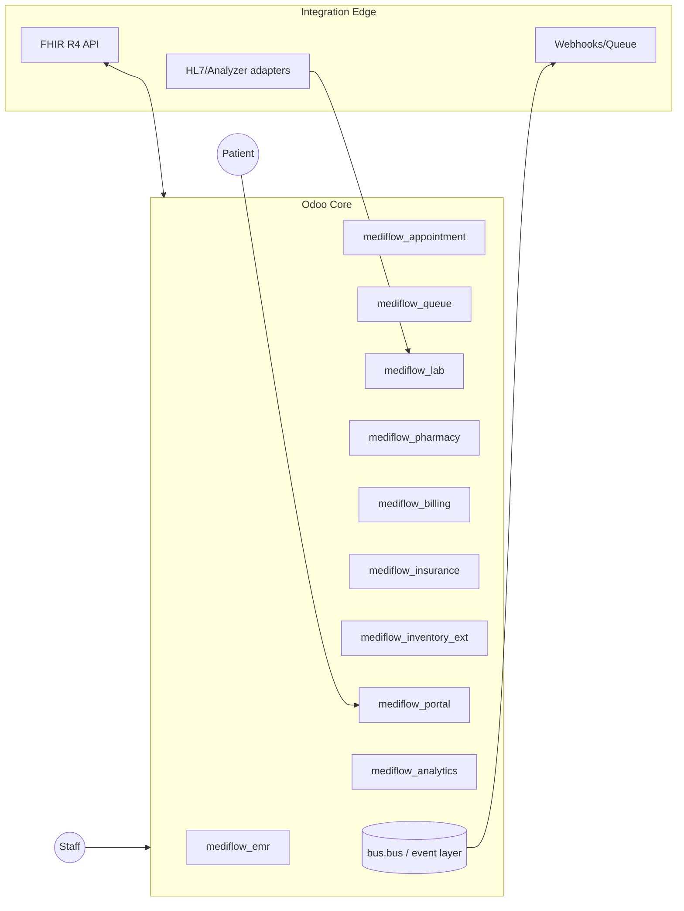

# 01 — Product Specification

**Platform:** MEDIFLOW Odoo Platform · **Phase:** 1 · **Audience:** Clinics, Diagnostic centers, Medical groups

---

## 1. Vision

A unified, FHIR-compatible clinical and operational platform built on Odoo that lets a medical group run
front-desk, clinical, diagnostic, pharmacy, and revenue workflows on one record of truth — designed from
day one for 100 clinics and millions of records without re-architecture.

## 2. Personas

| Persona | Primary goals | Key pain removed |
|---------|---------------|------------------|
| Patient | Book, check in, view results, pay | No phone tag, transparent results & bills |
| Receptionist / Front Desk | Register, schedule, manage queue, collect payment | Double-booking, manual queue boards |
| Doctor / Practitioner | See queue, document encounter, order labs/meds | Paper notes, lost orders |
| Nurse / MA | Vitals, triage, room assignment | Re-keying vitals |
| Lab Technician | Receive orders, run analyzers, release results | Manual result entry, transcription errors |
| Radiologist / Pathologist | Verify & sign diagnostic reports | Unsigned report leakage |
| Pharmacist | Dispense prescriptions, check interactions, stock | Stockouts, dispensing errors |
| Billing / Cashier | Invoice, apply insurance, collect, reconcile | Claim rejections, revenue leakage |
| Insurance Coordinator | Eligibility, pre-auth, claim submission | Denied claims, no audit trail |
| Inventory Manager | Stock levels, expiry, reorder | Expired drugs, emergency procurement |
| Clinic Manager / Admin | Throughput, revenue, utilization | No real-time visibility |
| Compliance Officer | Audit access, enforce minimum-necessary | Untraceable PHI access |

## 3. Functional scope (Phase 1 modules)

### 3.1 EMR-lite
- Patient master (demographics, identifiers, contacts, emergency contact, consents).
- Problem list, allergies/intolerances, medications, immunizations (lightweight, structured).
- Encounter record linking appointment → clinical note → orders → results → invoice.
- Clinical document = structured fields + free text; no full templating engine in Phase 1.

### 3.2 Appointment scheduling
- Resource model: practitioner, room, equipment, slot/calendar per clinic.
- Slot generation from working schedules; conflict detection; overbooking policy flag.
- Online (portal) + internal booking; reschedule/cancel with reason codes; waitlist.

### 3.3 Queue management
- Per-clinic, per-service-point queues (reception, triage, doctor room, lab draw, pharmacy).
- Token/ticket issuance, call-next, no-show handling, average wait analytics.
- Live queue board (kiosk/display) fed by event bus.

### 3.4 Doctor workflow
- "My Queue" → open encounter → vitals review → document → order (lab/imaging/Rx) → close.
- Order sets and favorites (config data, not hardcoded). e-Prescription generation.

### 3.5 Lab workflow
- Test catalog (LOINC-mappable), order → sample/specimen → accession → result entry/analyzer →
  verification → release. Reference ranges, abnormal flags, panels.

### 3.6 Pharmacy
- Prescription intake (internal + portal), interaction/allergy check, dispense, label, counsel.
- Links to inventory (decrement on dispense), billing (charge on dispense).

### 3.7 Billing
- Charge capture from encounter/lab/pharmacy; invoice on `account.move`; price lists per payer.
- Co-pay, deductible, discounts, taxes; receipts; refunds; daily cash reconciliation.

### 3.8 Insurance
- Payer master, member coverage, eligibility check, pre-authorization, claim build & submit,
  remittance/adjudication capture, denial management, patient responsibility calculation.

### 3.9 Inventory
- Drugs, consumables, reagents; lot/expiry tracking; multi-location (per clinic + central store);
- Reorder rules, stock moves on dispense/consume, cycle counts.

### 3.10 Patient portal
- Self-registration (verified), book/reschedule, check-in, view results (released only), view & pay
  invoices, download documents, manage consent.

### 3.11 Analytics
- Operational (throughput, wait time, utilization), clinical (test TAT, abnormal rates),
  revenue (collections, AR aging, denial rate), inventory (stockout, expiry exposure).

## 4. Out of scope for Phase 1 (explicit)

Full inpatient/IPD & bed management, OT scheduling, advanced clinical templates/order-set authoring UI,
PACS/DICOM viewer, national HIE certification, ML risk scoring, telemedicine video. These are Phase 2+.

## 5. Compliance & quality requirements

- **Access control:** role-based + record-rule enforced minimum-necessary; break-glass logged.
- **Auditability:** append-only audit of PHI access and clinical state transitions.
- **Data integrity:** released lab results and signed reports are immutable (amend-with-version only).
- **Consent:** explicit consent capture gating portal sharing and data export.
- **Encryption:** TLS in transit; DB/storage encryption at rest (infra layer).
- **Retention:** configurable retention & legal hold; soft-delete with audit, never hard-delete PHI.

## 6. Success metrics (Phase 1 acceptance)

| Metric | Target |
|--------|--------|
| Appointment booking P95 | < 500 ms |
| Clinical record open P95 | < 300 ms |
| Lab result release → portal visibility | < 5 s (event-driven) |
| Claim build accuracy (no manual rekey) | 100% from captured charges |
| Audit coverage of PHI access | 100% |
| Zero double-booking on same resource/slot | Enforced by constraint |

## 7. Architecture summary

See [04-odoo-modules.md](04-odoo-modules.md) for the full dependency graph.
