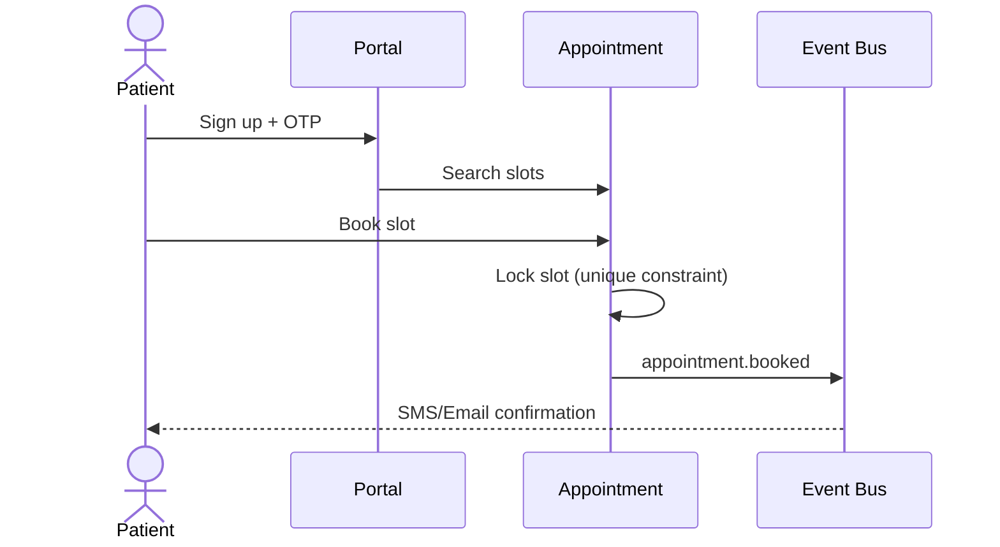
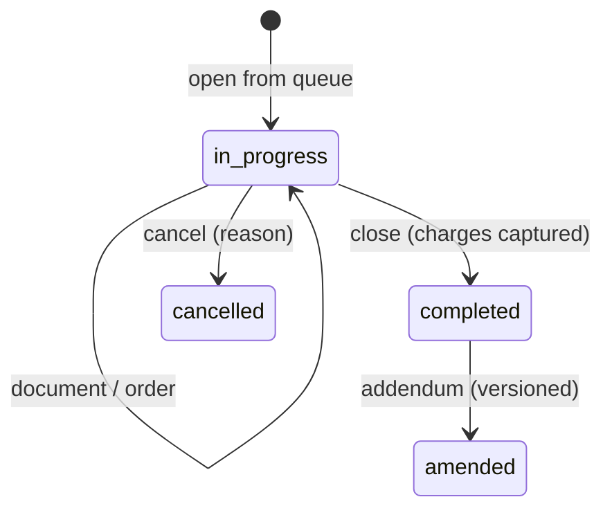
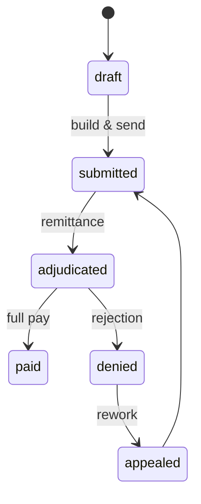

# 02 — User Journeys

End-to-end flows across all Phase 1 domains. Each journey lists actors, preconditions, steps, system
events (event-driven hooks), and exception paths. Events named here map to the bus/webhook layer in
[04-odoo-modules.md](04-odoo-modules.md) and the FHIR resources in [03-data-model.md](03-data-model.md).

---

## J1 — Patient self-registration & first appointment (Portal)

**Actors:** Patient, System, Receptionist (verification)
**Pre:** Patient has email/phone.

1. Patient signs up on portal → identity fields + OTP verification.
2. System creates `mediflow.patient` in `draft`, links a portal `res.users` (restricted group).
3. Patient searches specialty/clinic → sees available slots (`mediflow.appointment.slot`).
4. Patient books → `mediflow.appointment` created in `booked`; slot locked (DB constraint prevents
   double-book).
5. **Event:** `appointment.booked` → SMS/email confirmation; FHIR `Appointment` emitted.
6. Receptionist verifies identity on arrival → patient → `confirmed`.

**Exceptions:** OTP fail → registration blocked. Slot taken concurrently → optimistic-lock retry,
patient sees next slot. No-show → `no_show` after grace window (scheduled job).

---

## J2 — Walk-in registration, queue, and triage (Front desk)

**Actors:** Receptionist, Nurse, Patient
1. Receptionist registers/looks up patient (dedupe on national ID + DOB + phone).
2. Creates same-day `mediflow.appointment` (`walk_in=true`) or attaches to existing.
3. Check-in → patient enters **reception → triage** queue; token issued.
4. **Event:** `queue.entry.created` → live board updates.
5. Nurse calls next, records vitals (`mediflow.vital.sign`), assigns acuity, routes to doctor queue.

**Exceptions:** Duplicate patient detected → merge workflow (audit-logged). Long wait → escalation flag.

---

## J3 — Doctor encounter & ordering (Clinical)

**Actors:** Doctor, Patient
1. Doctor opens **My Queue** → selects waiting patient → `mediflow.encounter` opens (`in_progress`).
2. Reviews history, allergies, vitals, prior results.
3. Documents assessment (problem list, diagnosis ICD-mappable), plan.
4. Places orders: lab (`mediflow.lab.order`), imaging, prescription (`mediflow.prescription`).
5. **Events:** `lab.order.created`, `prescription.created` → routed to lab & pharmacy queues.
6. Closes encounter → `completed`; charges captured to draft invoice.

**Exceptions:** Allergy/interaction conflict on Rx → hard warning, override requires reason (logged).
Incomplete mandatory fields → cannot close.

---

## J4 — Lab order → result → release (Diagnostics)

**Actors:** Lab Tech, Pathologist/Verifier, Analyzer (device)
1. Lab receives `lab.order.created` → order appears in lab queue (`ordered`).
2. Specimen collected → `mediflow.specimen` accessioned (`collected` → `received`).
3. Result entered manually or via analyzer adapter (HL7) → `mediflow.lab.result` (`preliminary`).
4. Verifier reviews abnormal flags vs reference ranges → `verified`.
5. Authorized release → `released`; result immutable thereafter (amend = new version).
6. **Event:** `lab.result.released` → portal visibility + `DiagnosticReport` FHIR emit + doctor notified.

**Exceptions:** Analyzer mismatch (sample ID) → quarantine. Critical value → immediate alert event
`lab.critical.flagged` regardless of release state, routed to ordering doctor.

---

## J5 — Pharmacy dispense (Pharmacy + Inventory + Billing)

**Actors:** Pharmacist, Patient
1. `prescription.created` lands in pharmacy queue (`ordered`).
2. Pharmacist verifies, runs interaction/allergy recheck, selects stock lot (FEFO).
3. Dispense → inventory stock move decrements lot; `dispensed`.
4. **Events:** `pharmacy.dispensed` → charge to invoice; `inventory.move.done`.
5. Counsel patient; mark `handed_over`.

**Exceptions:** Insufficient stock → partial dispense + backorder. Expired lot blocked by constraint.

---

## J6 — Billing, insurance & collection (Revenue)

**Actors:** Cashier, Insurance Coordinator, Patient, Payer
1. Charges from encounter/lab/pharmacy aggregate to `account.move` (draft invoice).
2. If insured: eligibility check (`coverage.eligibility.checked`), split payer vs patient responsibility.
3. Pre-auth if required → `mediflow.preauth` (`requested` → `approved/denied`).
4. Invoice posted; patient pays co-pay (cash/card/portal).
5. Claim built from posted charges → `mediflow.claim` (`submitted`); remittance captured on adjudication.
6. **Events:** `invoice.posted`, `claim.submitted`, `payment.received`.

**Exceptions:** Denial → `denied` with reason code → rework/appeal queue. Underpayment → patient balance.

---

## J7 — Patient views results & pays online (Portal)

1. `lab.result.released` / `invoice.posted` → portal notification.
2. Patient logs in → views released results & documents (consent-gated, own records only).
3. Pays invoice via gateway → `payment.received` reconciles `account.move`.

**Exceptions:** Unreleased results never visible. Payment gateway failure → retry, no partial post.

---

## J8 — Inventory replenishment & expiry control

1. Reorder rule triggers when lot-aggregated qty < min → purchase suggestion.
2. Goods receipt → lots with expiry recorded.
3. Expiry job flags near-expiry → write-off workflow; expired lots blocked from dispense.
4. **Events:** `inventory.reorder.triggered`, `inventory.expiry.flagged`.

---

## J9 — Compliance audit (Cross-cutting)

1. Compliance Officer queries `mediflow.audit.log` by patient/user/time.
2. Reviews break-glass accesses (emergency override) with justification.
3. Exports access report; verifies minimum-necessary adherence.

**Every** PHI read/write and clinical state transition writes an immutable audit entry (see
[05-security-matrix.md](05-security-matrix.md) §Audit).
