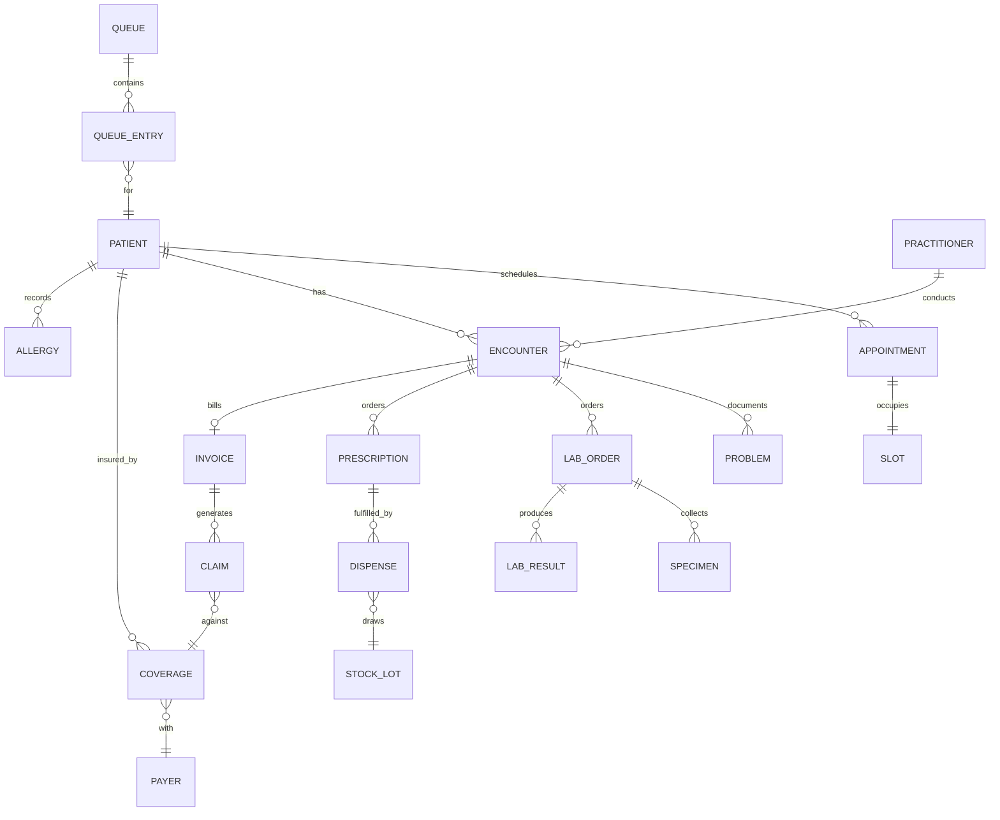

# 03 — Data Model

Canonical entity model for MEDIFLOW. All models are `res.company`-scoped (multi-clinic) unless noted.
Conventions: every PHI model carries `active` (soft delete), `company_id`, audit via `mail.thread`.
Money on `account.move` reuses Odoo accounting. FHIR mapping column shows the R4 resource each entity
projects to at the API boundary.

---

## 1. Entity catalog (logical)

| Domain | Model (`_name`) | Purpose | FHIR R4 |
|--------|-----------------|---------|---------|
| EMR | `mediflow.patient` | Patient master | Patient |
| EMR | `mediflow.practitioner` | Doctor/nurse/tech clinical identity | Practitioner / PractitionerRole |
| EMR | `mediflow.encounter` | Visit/clinical episode | Encounter |
| EMR | `mediflow.problem` | Problem/diagnosis list item | Condition |
| EMR | `mediflow.allergy` | Allergy/intolerance | AllergyIntolerance |
| EMR | `mediflow.vital.sign` | Vitals reading | Observation (vital-signs) |
| EMR | `mediflow.immunization` | Vaccination record | Immunization |
| EMR | `mediflow.consent` | Consent capture | Consent |
| EMR | `mediflow.clinical.document` | Structured note/attachment | DocumentReference |
| Scheduling | `mediflow.appointment` | Appointment | Appointment |
| Scheduling | `mediflow.appointment.slot` | Bookable slot | Slot |
| Scheduling | `mediflow.schedule` | Practitioner/resource working schedule | Schedule |
| Scheduling | `mediflow.resource` | Room/equipment resource | Location/Device |
| Queue | `mediflow.queue` | Service-point queue definition | — |
| Queue | `mediflow.queue.entry` | Token/ticket in queue | — |
| Lab | `mediflow.lab.test` | Test catalog item | (ServiceRequest def) |
| Lab | `mediflow.lab.panel` | Panel grouping tests | — |
| Lab | `mediflow.lab.order` | Lab order | ServiceRequest |
| Lab | `mediflow.specimen` | Specimen/sample | Specimen |
| Lab | `mediflow.lab.result` | Result/observation | Observation / DiagnosticReport |
| Pharmacy | `mediflow.prescription` | e-Prescription header | MedicationRequest |
| Pharmacy | `mediflow.prescription.line` | Rx line (drug, dose, sig) | MedicationRequest (dosage) |
| Pharmacy | `mediflow.dispense` | Dispense event | MedicationDispense |
| Billing | `account.move` (ext) | Invoice/charge | Invoice |
| Billing | `mediflow.charge.item` | Chargeable service/price | ChargeItem |
| Insurance | `mediflow.payer` | Insurance company | Organization |
| Insurance | `mediflow.coverage` | Patient coverage/policy | Coverage |
| Insurance | `mediflow.preauth` | Pre-authorization | (Claim/predetermination) |
| Insurance | `mediflow.claim` | Claim | Claim / ClaimResponse |
| Inventory | `product.product` (ext) | Drug/consumable/reagent | Medication |
| Inventory | `stock.lot` (ext) | Lot + expiry | — |
| Platform | `mediflow.audit.log` | Append-only PHI audit | AuditEvent |
| Platform | `mediflow.event` | Outbound integration event | — |

---

## 2. Core entity field specs (key fields)

### `mediflow.patient`
| Field | Type | Notes / Index |
|-------|------|----------------|
| `name` | char | computed full name |
| `mrn` | char | Medical Record Number, **unique per company**, indexed |
| `national_id` | char | encrypted-at-rest, indexed (dedupe) |
| `birthdate` | date | indexed (dedupe + age) |
| `gender` | selection | |
| `phone`, `email` | char | indexed |
| `partner_id` | m2o res.partner | bridges accounting/portal |
| `portal_user_id` | m2o res.users | restricted portal login |
| `emergency_contact_ids` | o2m | |
| `coverage_ids` | o2m mediflow.coverage | |
| `state` | selection | draft/active/inactive/deceased/merged |
| `company_id` | m2o res.company | **mandatory, indexed** |

**Constraints:** `UNIQUE(company_id, mrn)`; dedupe index on `(company_id, national_id, birthdate)`.

### `mediflow.encounter`
| Field | Type | Notes |
|-------|------|-------|
| `patient_id` | m2o | indexed |
| `practitioner_id` | m2o | indexed |
| `appointment_id` | m2o | |
| `clinic_id` | m2o res.company | indexed |
| `start`, `stop` | datetime | indexed on `start` |
| `state` | selection | planned/in_progress/completed/cancelled/amended |
| `problem_ids`, `order_ids`, `prescription_ids` | o2m/relations | |
| `invoice_id` | m2o account.move | |

### `mediflow.appointment` / `.slot`
- `appointment`: `patient_id`, `practitioner_id`, `resource_id`, `slot_id`, `start`, `stop`, `state`,
  `walk_in`, `reason_code`, `company_id`.
- `slot`: `schedule_id`, `practitioner_id`, `resource_id`, `start`, `stop`, `state(free/busy/blocked)`.
- **Constraint:** `EXCLUDE`/unique partial index preventing two non-cancelled appointments on the same
  `(practitioner_id, start)` and `(resource_id, start)` → guarantees no double-booking.

### `mediflow.lab.result`
- `order_id`, `test_id`, `value_numeric`/`value_text`, `unit`, `reference_low/high`, `abnormal_flag`,
  `status(preliminary/verified/released/amended)`, `version`, `verified_by`, `released_by`, `released_at`.
- **Immutability:** once `released`, fields are write-protected; corrections create `version+1` linked
  via `replaces_id`.

### `mediflow.claim`
- `coverage_id`, `payer_id`, `encounter_id`, `line_ids`, `total`, `payer_paid`, `patient_resp`,
  `status`, `denial_reason_id`, `remittance_ref`.

### `mediflow.audit.log` (append-only)
- `user_id`, `model`, `res_id`, `patient_id`, `action(read/write/create/unlink/state/break_glass)`,
  `timestamp`, `ip`, `reason`, `field_changes(jsonb)`. **No write/unlink** allowed after create.

---

## 3. Relationship overview (ERD)

---

## 4. Performance & scale design (1M+ records)

| Concern | Strategy |
|---------|----------|
| Multi-tenant isolation | `company_id` on every model + multi-company record rules; never global PHI reads |
| Hot lookups | Composite indexes: patient `(company_id, mrn)`, `(company_id, national_id, birthdate)`; encounter `(patient_id, start)`; result `(order_id, status)`; queue `(queue_id, state, sequence)` |
| Time-series growth (vitals, results 10M+) | Partition-friendly design: keep observation tables narrow; archive policy via `active` + dated archival job; consider PG native partitioning by `create_date`/clinic in Phase 2 |
| Double-booking | DB-level unique/exclusion constraint, not just Python check |
| List view latency | Default domains always filtered by `company_id` + date window; avoid unindexed `search` on text |
| Reporting load | Analytics reads from **SQL views / `read_group`**, never row-by-row ORM; heavy BI offloaded to read replica (see `09`) |
| Concurrency on slots | Optimistic locking + retry; `SELECT ... FOR UPDATE` on slot row during booking |
| Audit volume | `mediflow.audit.log` append-only, write-optimized, periodically rolled to cold storage |
| Attachments/documents | Stored via `ir.attachment` on object storage (S3-compatible), not DB blobs |

---

## 5. FHIR mapping principles

- Mapping lives at the **API boundary** (serializers in `mediflow_fhir_api`), not in storage — Odoo
  models stay relational/normalized; FHIR resources are projected on read and parsed on write.
- Identifiers: patient `mrn` → `Patient.identifier` (system = clinic URN); `national_id` → secondary
  identifier (consent-gated in export).
- Codings: tests carry optional LOINC, diagnoses ICD-10, drugs ATC/RxNorm code fields to enable
  faithful FHIR `CodeableConcept` output without lossy transforms.
- Versioned resources (lab result, document) expose FHIR `meta.versionId` from the `version` field.

See [04-odoo-modules.md](04-odoo-modules.md) for where each model lives and
[07-state-machines.md](07-state-machines.md) for lifecycle constraints referenced above.
