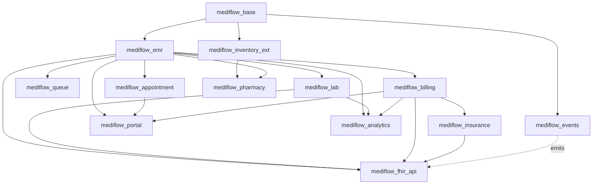
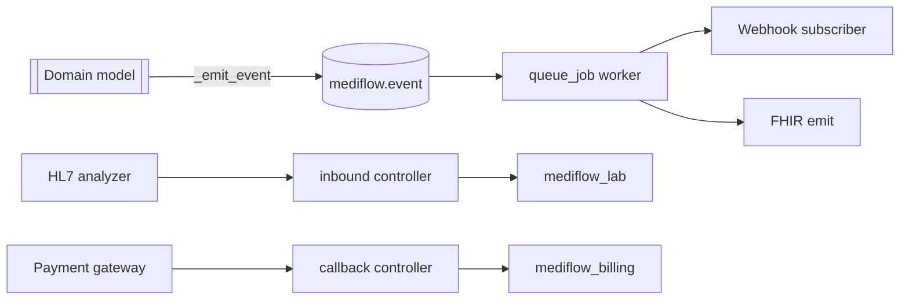

# 04 — Odoo Modules

Module decomposition follows **one domain = one module**, with a thin `mediflow_base` foundation and a
separate integration edge. No monolith: each module declares minimal dependencies so it can be upgraded
or disabled independently. Names are lowercase, `mediflow_` prefixed.

---

## 1. Module catalog

| Module | Responsibility | Depends on |
|--------|----------------|------------|
| `mediflow_base` | Shared mixins (PHI audit mixin, company-scope mixin, state-machine mixin), config, security groups, base menus | `base`, `mail` |
| `mediflow_emr` | Patient, practitioner, encounter, problem, allergy, vitals, immunization, consent, clinical document | `mediflow_base`, `contacts` |
| `mediflow_appointment` | Schedules, slots, resources, appointments, booking engine | `mediflow_emr`, `calendar` |
| `mediflow_queue` | Queues, entries, tokens, live board, call-next | `mediflow_emr`, `bus` |
| `mediflow_lab` | Test catalog, panels, orders, specimens, results, verification/release | `mediflow_emr` |
| `mediflow_pharmacy` | Prescriptions, dispense, interaction checks | `mediflow_emr`, `mediflow_inventory_ext` |
| `mediflow_inventory_ext` | Drug/reagent/consumable extension, lot+expiry, FEFO, reorder | `stock`, `mediflow_base` |
| `mediflow_billing` | Charge capture, charge items, invoicing on `account.move` | `mediflow_emr`, `account` |
| `mediflow_insurance` | Payers, coverage, eligibility, pre-auth, claims, remittance | `mediflow_billing` |
| `mediflow_portal` | Patient self-service (register, book, results, pay, consent) | `mediflow_emr`, `mediflow_appointment`, `mediflow_billing`, `portal`, `website` |
| `mediflow_analytics` | Dashboards, KPIs, SQL views, scheduled aggregates | `mediflow_emr`, `mediflow_lab`, `mediflow_billing`, `web` (spreadsheet/dashboard) |
| `mediflow_fhir_api` | FHIR R4 controllers, serializers, OAuth scopes | `mediflow_emr`, `mediflow_lab`, `mediflow_appointment`, `mediflow_billing`, `mediflow_insurance` |
| `mediflow_events` | Event bus abstraction, outbound webhooks, queue jobs, HL7/analyzer adapters | `mediflow_base`, `bus`, (`queue_job` OCA) |

> `mediflow_base`, `mediflow_emr`, `mediflow_events` form the **kernel**. Everything else is optional and
> independently deployable per clinic profile (e.g., a clinic without a lab simply omits `mediflow_lab`).

---

## 2. Dependency graph



---

## 3. Standard module skeleton (applies to each)

```
mediflow_<domain>/
├── __init__.py
├── __manifest__.py
├── models/                # one file per model, <800 lines each
├── security/
│   ├── <domain>_groups.xml
│   ├── ir.model.access.csv
│   └── <domain>_record_rules.xml
├── data/                  # config data (catalogs, sequences, cron)
├── views/                 # backend views, actions, menus
├── controllers/           # portal / API (where relevant)
├── wizards/               # transient flows (merge patient, claim build)
├── report/                # QWeb reports (Rx, lab report, invoice)
├── static/                # JS for queue board, dashboards
└── tests/                 # unit + integration (80%+ coverage target)
```

**Manifest discipline:** explicit `depends`, pinned `version` (`18.0.1.0.0` style), `license`,
`application=True` only for `mediflow_base`. No circular deps (enforced by graph above).

---

## 4. Event-driven layer (`mediflow_events`)

- **Internal:** `bus.bus` channels for live UI (queue board, notifications).
- **Async work:** OCA `queue_job` for FHIR emit, webhook delivery, analyzer ingest, claim submission —
  keeps request latency low under load (1M records / 100 clinics).
- **Outbound contract:** every domain raises a typed event via a single helper
  (`self._emit_event(name, payload)`) which writes `mediflow.event` (audit + retry) then enqueues
  delivery. Names match the journeys (`appointment.booked`, `lab.result.released`, `claim.submitted`…).
- **Inbound adapters:** HL7/analyzer + payment gateway callbacks land on dedicated controllers,
  normalized into domain calls (never direct DB writes).



---

## 5. Why this decomposition scales

- Independent upgrade & blast-radius isolation (a billing migration can't break the lab).
- Per-clinic feature toggling without code forks.
- Clear ownership for security (`ir.model.access` + record rules live with their module — see `05`/`06`).
- Analytics reads are isolated and can target a replica without touching transactional modules.
