# 07 — State Machines

Lifecycle definitions for every stateful entity. Each machine lists states, allowed transitions, guards
(who/what), side effects (events emitted), and immutability rules. Transitions are enforced in a shared
`StateMachineMixin` (in `mediflow_base`) so they cannot be bypassed by direct writes, and each transition
writes an audit entry.

---

## 1. Appointment — `mediflow.appointment`

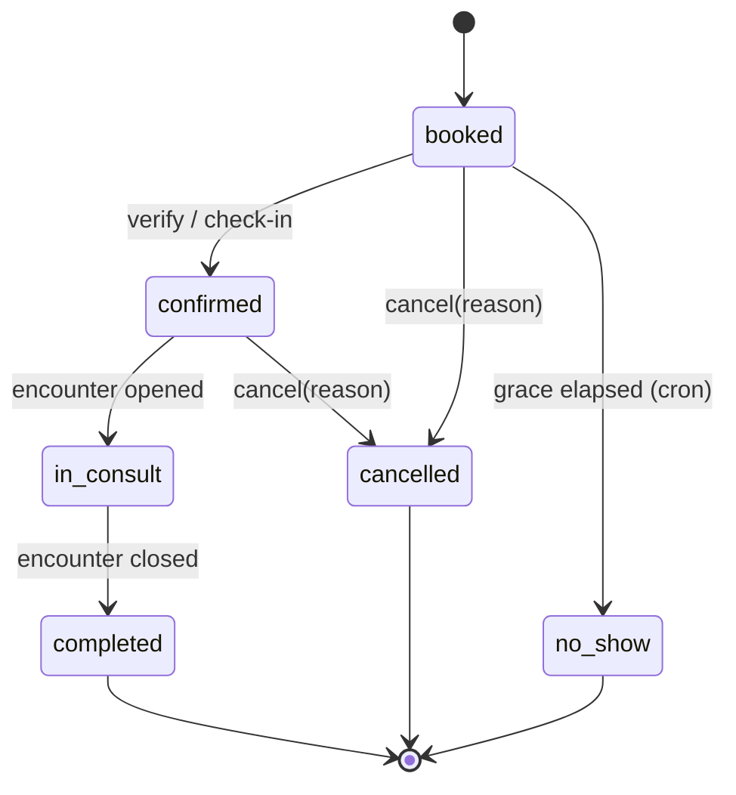

| Transition | Guard | Side effect |
|-----------|-------|-------------|
| →booked | reception/portal; slot free (DB constraint) | `appointment.booked`; lock slot |
| booked→confirmed | reception (check-in) | enqueue to reception/triage queue |
| →cancelled | reception/portal; not completed | free slot; `appointment.cancelled` |
| booked→no_show | cron after grace | `appointment.no_show` |
| confirmed→in_consult | doctor opens encounter | create encounter |
| in_consult→completed | encounter completed | `appointment.completed` |

---

## 2. Encounter — `mediflow.encounter`

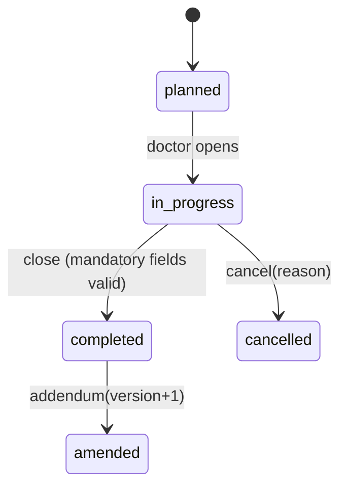

| Transition | Guard | Side effect |
|-----------|-------|-------------|
| in_progress→completed | required fields present; orders saved | capture charges → draft invoice; `encounter.completed` |
| completed→amended | doctor; creates linked addendum, original immutable | new version; `encounter.amended` |

**Immutability:** `completed` encounters are read-only except addendum; never hard-edited.

---

## 3. Lab order — `mediflow.lab.order`

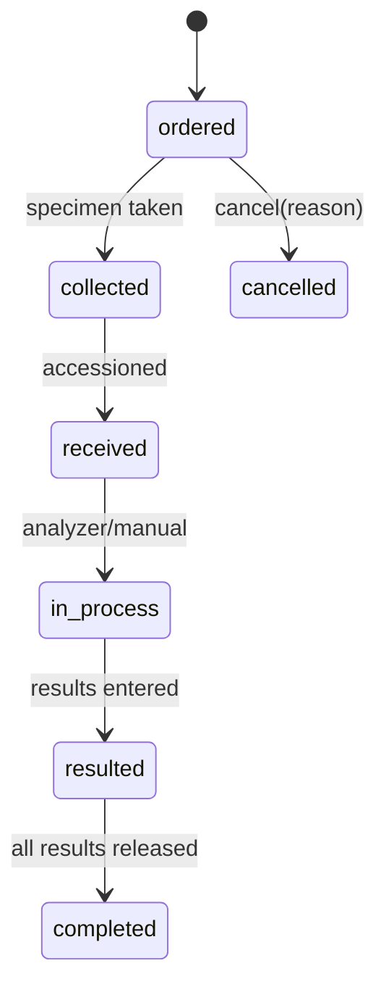

Side effects: `lab.order.created` on create; routes to lab queue; `collected`/`received` update specimen.

---

## 4. Lab result — `mediflow.lab.result` (critical immutability)

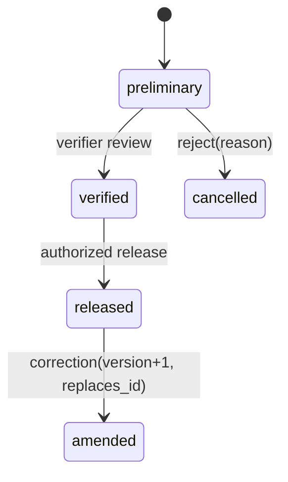

| Transition | Guard | Side effect |
|-----------|-------|-------------|
| →preliminary | lab tech / analyzer | abnormal flag computed vs reference range |
| preliminary→verified | `lab_verifier` only | — |
| verified→released | `lab_verifier`/authorized | `lab.result.released` → portal + FHIR DiagnosticReport; doctor notified |
| any→ (critical value) | auto-detect | `lab.critical.flagged` immediate alert (independent of state) |
| released→amended | verifier; original kept | new version row; `lab.result.amended` |

**Hard rule:** no transition or field write is permitted on a `released` row except creating an amended
successor. Enforced by mixin + record rule + DB write guard.

---

## 5. Prescription — `mediflow.prescription`

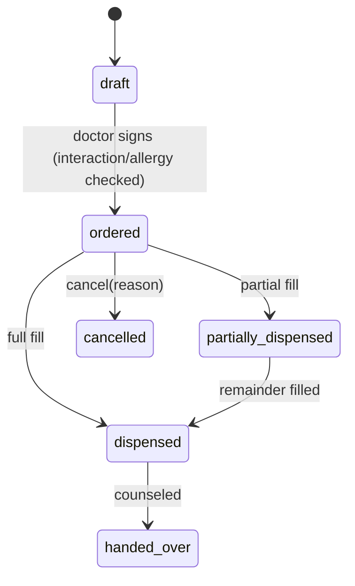

Guards: `draft→ordered` blocked on unresolved allergy/interaction unless override+reason (audited).
Side effects: `prescription.created`; on dispense → inventory move + billing charge.

---

## 6. Dispense — `mediflow.dispense`

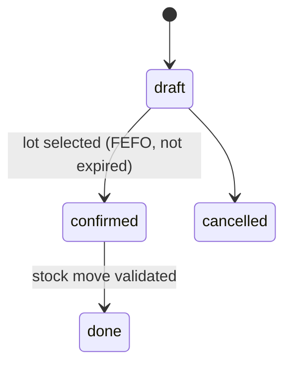

Guard: expired/ insufficient lot blocked by constraint. Side effect: `pharmacy.dispensed`,
`inventory.move.done`, charge capture.

---

## 7. Invoice — `account.move` (MEDIFLOW usage)

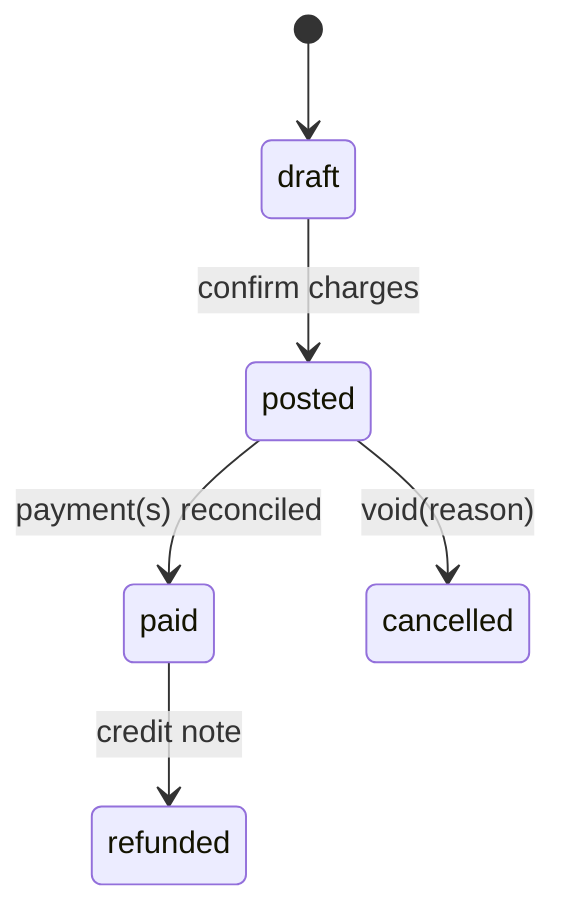

Side effects: `invoice.posted`, `payment.received`. Insurance split computed at `draft→posted`.

---

## 8. Pre-authorization — `mediflow.preauth`

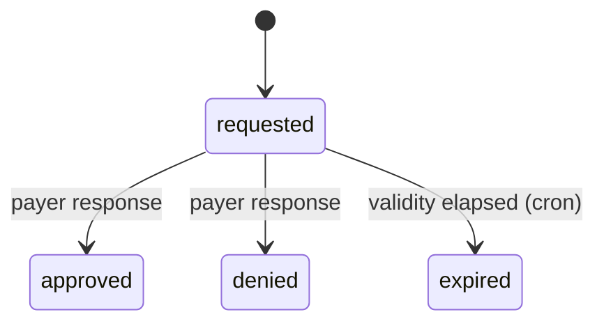

---

## 9. Claim — `mediflow.claim`

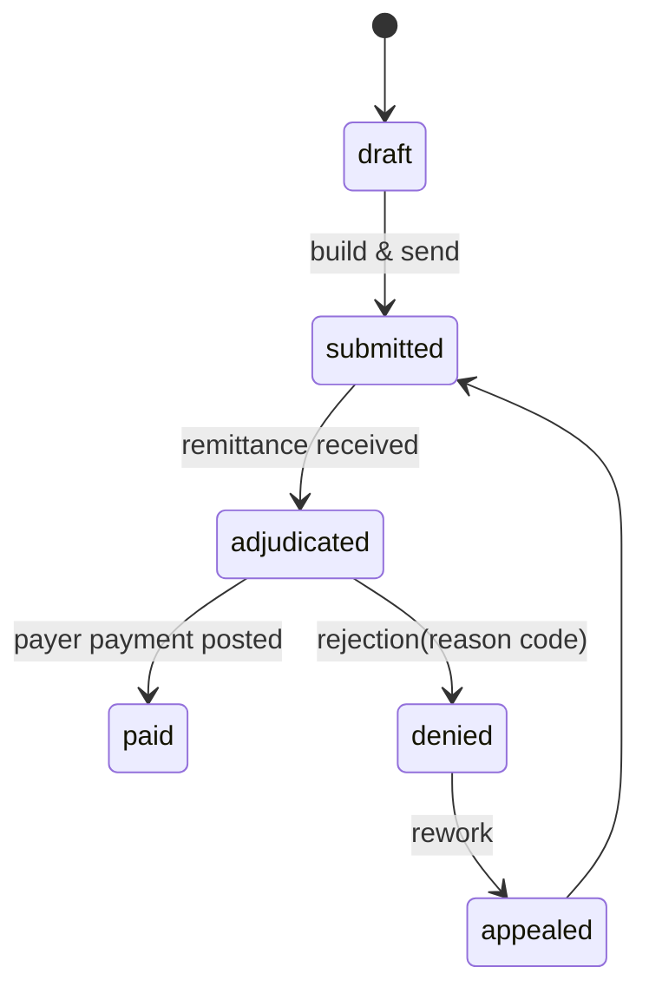

Side effects: `claim.submitted`, `claim.adjudicated`, `claim.denied`. Patient responsibility recomputed
on adjudication → patient balance on invoice.

---

## 10. Queue entry — `mediflow.queue.entry`

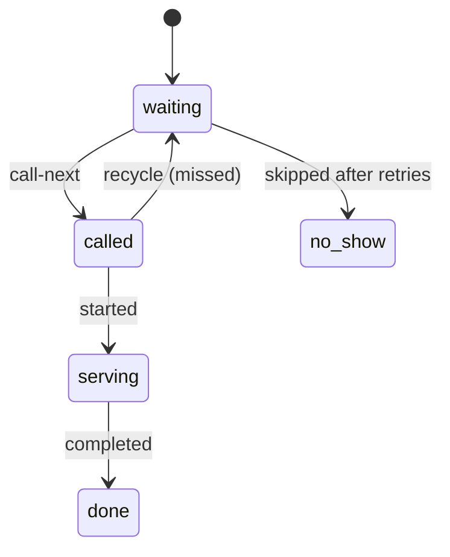

Side effects: every transition pushes a `bus.bus` message → live board; `queue.entry.*` events.

---

## 11. Patient — `mediflow.patient`

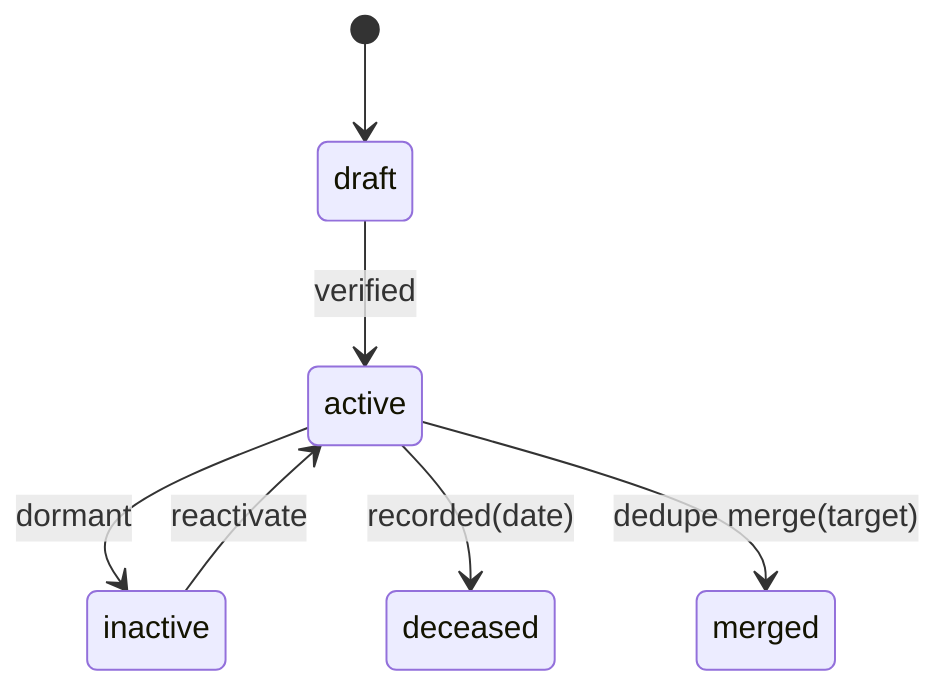

`merged` patients become read-only pointers to the surviving record (audit-logged merge).

---

## 12. Cross-cutting enforcement

- All transitions go through `StateMachineMixin.transition(target, reason=None)` which validates the
  allowed map, checks the caller's group, writes audit, then emits the event.
- Illegal direct `write({'state': ...})` is rejected by an override that consults the transition map.
- Terminal/immutable states (`released`, `completed`, `merged`, `paid`) are write-guarded at ORM level.
