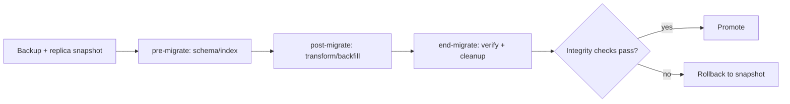

# 09 — Upgrade Strategy

How MEDIFLOW evolves safely across Odoo versions, module releases, and data growth — without breaking PHI
integrity, security rules, or running clinics. Covers module versioning, data migrations, schema/index
evolution, deployment topology for scale, and rollback.

---

## 1. Versioning model

- **Semantic module versions:** `<odoo_major>.<feature>.<fix>` e.g. `18.0.1.2.0`. Bump rules:
  - patch (`x.x.+`) — bugfix, no schema change.
  - minor (`x.+.0`) — additive fields/models, backward-compatible.
  - major (`+.0.0`) — breaking schema/behavior, requires migration scripts + sign-off.
- **Kernel stability:** `mediflow_base` API (mixins, event helper, state machine) is a contract; breaking
  changes there require coordinated major bumps across dependents.
- **Per-module independence:** because of the clean dependency graph ([04](04-odoo-modules.md)), a clinic
  can upgrade billing without forcing a lab upgrade, as long as kernel contract holds.

---

## 2. Data migration framework

- Use Odoo's `migrations/<version>/{pre,post,end}-migrate.py` per module; prefer **OpenUpgrade-style**
  helpers (OCA `openupgradelib`) for renames/moves.
- **Phases:**
  - `pre-migrate`: schema prep, add columns/indexes, backfill nullable.
  - `post-migrate`: data transforms, recompute, relink.
  - `end-migrate`: integrity checks, drop deprecated columns (only after a deprecation cycle).
- **Never destructive in one step.** Rename = add new + copy + dual-write deprecation window + drop later.
- **PHI safety:** migrations that touch clinical data run inside a transaction with a verifiable row-count
  and checksum assertion; abort + rollback on mismatch. No PHI hard-deletes ever.

---

## 3. Schema & index evolution at scale (1M+ rows)

- **Online, non-blocking changes:** add columns nullable; create indexes `CONCURRENTLY`; avoid full-table
  rewrites during business hours.
- **Large backfills batched** (e.g., 10k rows/commit) via `queue_job` to avoid long locks.
- **Partitioning roadmap:** time-series tables (`lab.result`, `vital.sign`, `audit.log`) move to native
  PostgreSQL partitioning (by month or clinic) when row counts cross thresholds; design already keeps
  these tables narrow to make partitioning cheap.
- **Index governance:** every new hot query ships with its index in the same PR; periodic `pg_stat`
  review prunes unused indexes.

---

## 4. Deployment topology for performance

| Layer | Strategy |
|-------|----------|
| App | Horizontally scaled Odoo workers; dedicated cron/queue_job workers separate from HTTP |
| DB | Primary (writes) + one or more **read replicas** for analytics/FHIR reads |
| Cache/bus | Redis-backed session + `bus` for live boards across workers |
| Storage | Object storage (S3-compatible) for `ir.attachment` (docs, reports), encrypted |
| Integration | `mediflow_events` workers isolated so webhook/HL7 load can't starve clinical UI |

- **Blue-green / canary:** deploy new module versions to a canary clinic set first; promote after health
  checks. Multi-company isolation makes canary-by-clinic natural.
- **Zero-downtime target:** schema-additive minor upgrades roll without downtime; majors use a short
  maintenance window with pre-staged migration.

---

## 5. Upgrade workflow (per release)

1. **Freeze & tag** source; generate changelog from conventional commits.
2. **Restore prod snapshot** to a staging DB (anonymized PHI where used for QA).
3. **Run migrations** on staging; assert integrity checks + run full test suite (incl. security tests
   from [06](06-record-rules.md) §5).
4. **Performance gate:** run load profile (booking, result release, dashboard) against staging; must meet
   P95 targets from [01](01-product-specification.md) §6.
5. **Security gate:** re-run record-rule + state-machine test matrix; CI blocks on any regression.
6. **Canary deploy** to subset of clinics; monitor events/error rate/latency.
7. **Promote** fleet-wide; keep prior version image for rollback.

---

## 6. Rollback & disaster recovery

- **Backups:** continuous WAL archiving + daily base backups; PITR (point-in-time recovery).
- **Pre-upgrade snapshot** mandatory; rollback = restore snapshot + redeploy prior image.
- **Forward-fix preference** for data already written post-upgrade (to avoid losing new PHI); use
  compensating migration rather than blind restore when clinical data changed after cutover.
- **RPO/RTO targets:** RPO ≤ 5 min (WAL), RTO ≤ 1 h for full restore; documented runbook.

---

## 7. FHIR & integration compatibility

- FHIR serializers are **versioned** and decoupled from storage, so internal schema changes don't break
  external subscribers; resource shape changes go through a deprecation window with both versions served.
- Outbound event payloads are versioned (`event.version`); subscribers negotiate; `mediflow.event`
  retains delivery + retry state for replay after consumer outages.

---

## 8. Deprecation policy

- Mark deprecated fields/events in release notes + code annotations; keep for **one minor cycle** minimum.
- Provide migration helper + dual-read window before removal.
- Communicate breaking changes to integration partners ahead of major releases.

---

## Phase boundary

**Phase 1 is complete with this document.** Per instruction, work pauses here. Phase 2 (module scaffolding
and skeletons) and Phase 3 (implementation + tests) begin only after Phase 1 review and sign-off.
